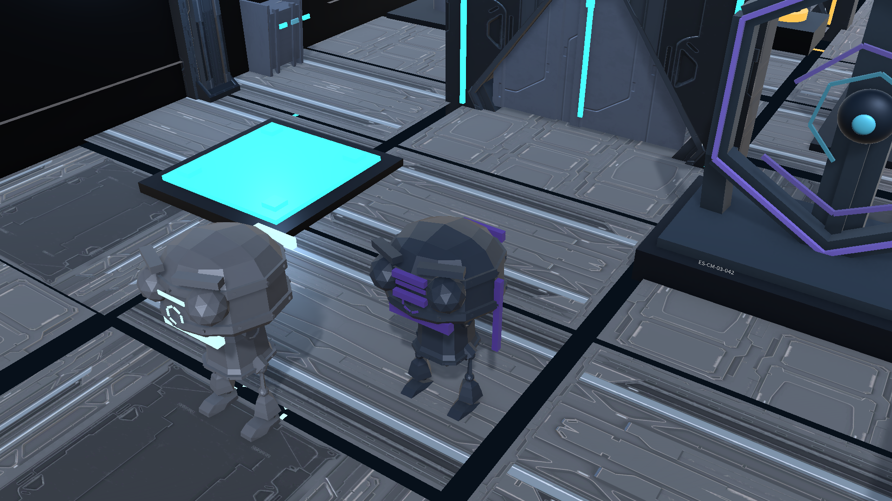

# ECHO//SHIFT



**過去の自分の移動と操作をEchoとして再生し、現在の自分と協力して仕掛けを解くUnity製3Dパズルゲーム。**

ECHO//SHIFTは、PressurePlate、Battery、PowerSocket、Doorを複数ループに分けて操作する個人制作のプロトタイプです。最大3体のEchoが記録済みの行動を同時再生し、現在のPlayerがその結果を利用してGoalを目指します。

## Overview

| 項目 | 内容 |
| --- | --- |
| Genre | Top-down 3D time-loop puzzle |
| Engine | Unity `6000.4.6f1` / Universal Render Pipeline `17.4.0` |
| Language | C# |
| Platform | Windows x86_64 |
| Development style | 個人制作。Codexを実装・調査・検証支援に使用し、仕様、優先順位、受入基準、Human Reviewを人間が決定 |
| Development period | 2026-07-19〜2026-08-09（Git履歴で確認できる開発・検証期間） |
| Current status | Phase 5A source/test/presentation validation passed; Windows graphical shutdown issue remains |

## Gameplay Video

[Gameplay video — 50 seconds (MP4)](https://github.com/ypkabu/ECHOSHIFT/releases/download/ca-game-gym-submission-media-v1/ECHOSHIFT_CA_Game_Gym_Gameplay.mp4)

記録した行動がEchoとして再生され、現在のPlayerとPlate、Battery、Doorを協調操作する流れを通常速度でまとめています。配布Buildではなく、動画とsourceを応募時の主導線にしています。

## Gameplay

1. 現在のPlayerで移動や装置操作を記録します。
2. `R`または制限時間でループを終了すると、記録がEchoになります。
3. EchoへPlate保持やBattery運搬・挿入を任せ、現在のPlayerで開いたDoorを通過します。
4. Section 3ではEcho 1とEcho 2へ異なる役割を記録し、3つのActor状態を協調させます。


## Core Mechanic

Replayは60 Hzの明示的なfixed tickで進みます。各frameは入力commandと期待poseを保持し、ループ確定後はimmutableです。既存Echoは新ループ開始時にtick 0へ戻り、Playerと同じmovement実装で再生します。記録が短い場合は記録済み範囲だけを再生し、最終poseで停止します。

移動だけでなく、Battery取得とPowerSocket挿入も記録します。InteractionはSceneへ保存したStable IDを解決し、近くの別targetへfallbackしません。これにより「過去の自分がどの装置を操作したか」をReplay中も一意に保ちます。

## Technical Highlights

### 1. Replayの再現性とPhysics境界

- `SimulationClock`と`LoopDirector`で入力、移動、Physics同期、Interaction解決、Door commit、pose記録を明示的なtick順へ分離しました。
- Player/Echoは互いに物理衝突せず、Environmentには衝突し、PressurePlate/Goal triggerには反応するLayer構成です。
- 実Scene自動完走で最大Replay Drift `0 m`を計測しています（許容値 `0.05 m`）。

### 2. Recorded InteractionとCarryの状態整合性

- movement frameとは別に、成功したInteractionだけをtick、operation、Stable ID、検証位置として記録します。
- BatteryをActor階層の子にするとEcho破棄時にBatteryまで失われる問題があったため、所有状態を独立させ、Carry Socketのposeだけを追従する構造へ変更しました。
- target消失、重複所有、loop reset、Echo evictionを含むEditMode/PlayModeテストで回帰を防いでいます。

### 3. GameplayとPresentationの分離

- Camera、HUD、Pause、Tutorial、Robot pose、Audio/VFXは、固定tick ReplayやColliderを変更しないpresentation layerとして実装しています。
- Human Visual Reviewで見つかったCamera切れ、仮UI、T-pose、浮遊装飾、過剰VFXをBuilderの生成元から修正し、同じ問題が再生成されないテストを追加しました。

### 4. Unity Editor自動化

- P0〜P3のScene Builder、Layer設定、Stable ID検証、Build Settings、Capture、Windows BuildをEditor codeから再現できます。
- Phase 5Aでは、承認済みProduction assetをBuilderが不要に再serializeする問題を、exact SHA-256のcanonical guardとfail-closed検証で修正しました。
- Runtime、Editor、EditMode tests、PlayMode testsはAssembly Definitionで分離しています。

### 5. 実Sceneを含む自動検証

- 最新のFormal Revalidation: EditMode `151/151`、PlayMode `131/131` Pass。
- P0〜P3の実Scene load、Missing Component/Reference、P3全Section自動完走を検証しています。
- P3正常解法: Interaction `4` success / `0` failure、最大Replay Drift `0 m`。
- Compiler error/warning、Missing、NullReference、Unhandled Exceptionの検証ログ一致は各`0`です。

詳細は[Phase 5A Formal Revalidation](Docs/Phase5AFormalRevalidation.md)と[Test Plan](Docs/TestPlan.md)を参照してください。

## Controls

- `W` `A` `S` `D` / Gamepad Left Stick: 移動
- `E` / Gamepad South Button: Interaction
- `R` / Gamepad Start Button: 現在のループを終了
- `Escape` / Gamepad Select Button: Pause / Resume
- Pause Menu: Resume、Restart Section、Restart Game、Quit

## Project Structure

```text
Unity/Assets/_Project/
├─ Scripts/Runtime/    fixed-tick simulation, replay, interaction, UI/audio
├─ Scripts/Editor/     Scene Builder, validators, capture/build pipelines
├─ Scripts/Tests/      EditMode and PlayMode suites
├─ Scenes/             P0-P3 generated scenes
├─ Art/                project-owned wrappers, materials and visual assets
└─ ThirdParty/         curated licensed source assets
Docs/
├─ ADR/                architecture decisions
├─ Application/        application-specific material
└─ *Validation.md      measured validation records
```

## Open and Verify

1. Unity Hubで`Unity/`をUnity `6000.4.6f1`として開きます。
2. `ECHO SHIFT/Build Phase 3 Scene`で`P3_PlayableGreybox.unity`を生成・確認します。
3. BatchModeのScene Builder、EditMode、PlayMode、Buildコマンドは[Docs/TestPlan.md](Docs/TestPlan.md)に記録しています。

## Git and Development Record

Git履歴はPhase単位のfeature branch、`feat` / `fix` / `test` / `docs`などの目的別commit、検証済み地点のtagで構成しています。応募準備前までに53 commitsがあり、Phase 0〜3は`main`へfast-forwardで統合、Phase 4以降は公開時にPull Requestで`main`へ統合しました。これは個人開発の履歴であり、共同開発でのPull Request経験を示すものではありません。

応募向けの詳細は[Git Experience](Docs/Application/CA_Game_Gym/GitExperience.md)と[Evidence](Docs/Application/CA_Game_Gym/Evidence.md)に整理しています。

## AI-assisted Development

本作は個人制作で、Codexをコード実装、調査、テスト作成、文書化の支援に使用しています。AI出力をそのまま完成扱いにはせず、仕様と優先順位は人間が提示し、Git diff、Unity batchmode、実Scene回帰、自動完走、Human Visual/Audio Reviewで採否を判断しました。面接では、採用した設計、失敗した検証、残した制約をコードとcommit単位で説明します。

## Assets and Licenses

- Quaternius Modular Sci-Fi MegaKit / Animated Robot Pack: CC0 1.0
- Kenney Sci-Fi Sounds: CC0 1.0をsourceとするproject-owned derived WAV
- Noto Sans JP: SIL Open Font License

公式配布元、取得版、hash、使用subset、変更内容、noticeは[Docs/ThirdPartyAssets.md](Docs/ThirdPartyAssets.md)と`ThirdPartyNotices/`に記録しています。

Project-owned source code and assets are published for portfolio review under the [repository license](LICENSE.md). Third-party materials remain subject to their individual notices.

## Known Limitations

- Windowsの画面付きStandaloneは、終了時に`UnityPlayer.dll` native cleanup内で`0xC0000005`を再現するため、配布可能なrelease buildとしては未承認です。Gameplay中のmanaged exceptionではなく、調査境界と再現matrixは[Phase 4 Windows Exit Crash Investigation](Docs/Phase4WindowsExitCrashInvestigation.md)に記録しています。
- Steamworks、save data、enemy AI、combat、installer/signingは未実装です。
- Replay Driftは計測しますが補正しません。任意のRigidbody状態を巻き戻す仕組みではありません。
- 画面付きBuildは主提出物にせず、公開repositoryとGameplay動画を応募導線にしています。
