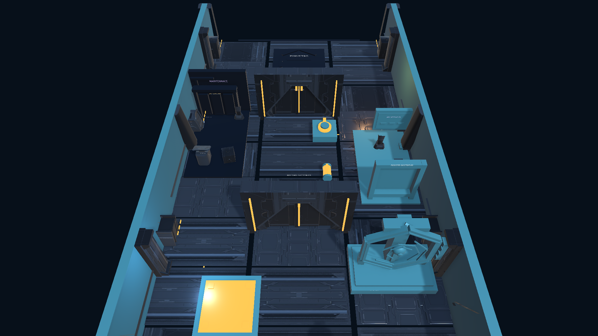

# ECHO//SHIFT


**過去の自分の移動と操作をEchoとして再生し、現在の自分と協力して仕掛けを解くUnity製3Dパズルゲーム。**

ECHO//SHIFTは、感圧板、バッテリー、電源ソケット、ドアを複数のループに分けて操作する個人制作のプロトタイプです。最大3体のEchoが記録済みの行動を同時に再生し、現在のプレイヤーがその結果を利用してゴールを目指します。

## 概要

| 項目 | 内容 |
| --- | --- |
| ジャンル | 見下ろし型3Dタイムループパズル |
| ゲームエンジン | Unity `6000.4.6f1` / Universal Render Pipeline `17.4.0` |
| 開発言語 | C# |
| 対応環境 | Windows x86_64 |
| 開発形態 | 個人制作。仕様、設計、実装、検証、プレイテストを一貫して管理 |
| 開発期間 | 2026-07-19〜2026-08-09（Git履歴で確認できる開発・検証期間） |
| 現在の状態 | プレイ可能なプロトタイプ。ゲームプレイと回帰テストを検証済み |

## プレイ動画

[プレイ動画 — 50秒（MP4）](https://github.com/ypkabu/ECHOSHIFT/releases/download/portfolio-demo-v1/ECHOSHIFT_Gameplay_Demo.mp4)

記録した行動がEchoとして再生され、現在のプレイヤーと感圧板、バッテリー、ドアを連携して操作する流れを通常速度でまとめた50秒のプレイ動画です。

## ゲームの流れ

1. 現在のプレイヤーで移動や装置操作を記録します。
2. `R`または制限時間でループを終了すると、記録がEchoになります。
3. Echoに感圧板の保持やバッテリーの運搬・挿入を任せ、現在のプレイヤーで開いたドアを通過します。
4. セクション3ではEcho 1とEcho 2に異なる役割を記録し、3体の状態を連携させます。



## 担当範囲

個人制作として、ゲームデザイン、C#によるリプレイ／インタラクション実装、Unity Editor上のシーン生成、UI・音響・VFX、テストとプレイテストを担当しました。

## コアシステム

リプレイは60 Hzの明示的なfixed tickで進みます。各フレームは入力と期待する位置・姿勢を保持し、ループ確定後は変更しません。既存のEchoは新しいループの開始時にtick 0へ戻り、プレイヤーと同じ移動処理で再生します。記録が短い場合は記録済みの範囲だけを再生し、最後の位置・姿勢で停止します。

移動だけでなく、バッテリーの取得と電源ソケットへの挿入も記録します。インタラクションではシーンに保存したStable IDを参照し、近くにある別の対象へ置き換えません。これにより「過去の自分がどの装置を操作したか」をリプレイ中も一意に保ちます。

## 技術的な工夫

### 1. リプレイの再現性と物理処理の境界

- `SimulationClock`と`LoopDirector`で、入力、移動、物理同期、インタラクションの解決、ドア状態の確定、位置・姿勢の記録を明示的なtick順に分離しました。
- プレイヤーとEchoは互いに物理衝突せず、環境には衝突し、感圧板とゴールの判定には反応するレイヤー構成です。
- 実際のシーンを自動完走させ、最大Replay Drift `0 m`を計測しています（許容値 `0.05 m`）。

### 2. 記録したインタラクションと持ち運び状態の整合性

- 移動フレームとは別に、成功したインタラクションだけをtick、操作種別、Stable ID、検証位置として記録します。
- バッテリーをキャラクター階層の子にするとEchoの破棄時にバッテリーまで失われる問題があったため、所有状態を独立させ、Carry Socketの位置・姿勢だけを追従する構造へ変更しました。
- 対象の消失、重複所有、ループのリセット、上限を超えたEchoの削除を含むEditMode/PlayModeテストで回帰を防いでいます。

### 3. ゲーム処理と表示・演出の分離

- カメラ、HUD、一時停止、チュートリアル、ロボットの姿勢、音響・VFXは、fixed tickによるリプレイやColliderを変更しない表示・演出部分として実装しています。
- プレイテストと画面確認で見つかったカメラ切れ、仮UI、T-pose、浮遊装飾、過剰なVFXをシーン生成処理から修正し、同じ問題が再発しないようテストを追加しました。

### 4. Unity Editorによる自動化

- P0〜P3のシーン生成、レイヤー設定、Stable ID検証、Build Settings、キャプチャ、WindowsビルドをEditorコードから再現できます。
- シーン生成処理が本番アセットを意図せず再保存する問題に対し、生成前後のハッシュ確認を追加し、想定外の差分がある場合は処理を停止するよう修正しました。
- Runtime、Editor、EditModeテスト、PlayModeテストはAssembly Definitionで分離しています。

### 5. 実際のシーンを含む検証

- EditMode `151/151`、PlayMode `131/131`が成功。
- P0〜P3の実シーン読み込み、Missing Component/Reference、P3全セクションの自動完走を検証しています。
- P3の正常解法：インタラクション `4`回成功 / `0`回失敗、最大Replay Drift `0 m`。
- コンパイラーのエラー／警告、Missing、NullReference、Unhandled Exceptionに一致する検証ログは各`0`です。

結果の要約は[検証結果の要約](Docs/ValidationSummary.md)、検証方法は[テスト計画](Docs/TestPlan.md)を参照してください。

## 操作方法

- `W` `A` `S` `D` / ゲームパッド左スティック：移動
- `E` / ゲームパッドSouthボタン：インタラクション
- `R` / ゲームパッドStartボタン：現在のループを終了
- `Escape` / ゲームパッドSelectボタン：一時停止 / 再開
- ポーズメニュー：`Resume`、`Restart Section`、`Restart Game`、`Quit`

## プロジェクト構成

```text
Unity/Assets/_Project/
├─ Scripts/Runtime/    fixed tick、リプレイ、インタラクション、UI・音響
├─ Scripts/Editor/     シーン生成、検証、キャプチャ・ビルド処理
├─ Scripts/Tests/      EditMode・PlayModeテスト
├─ Scenes/             生成済みのP0〜P3シーン
├─ Art/                本プロジェクトのマテリアル・表示用アセット
└─ ThirdParty/         ライセンスを確認した外部アセット
Docs/
├─ ADR/                設計判断の記録
├─ Media/              README用画像
└─ *Validation.md      計測を伴う検証記録
```

## 動作確認

1. Unity Hubから`Unity/`をUnity `6000.4.6f1`で開きます。
2. `ECHO SHIFT/Build Phase 3 Scene`を実行し、`P3_PlayableGreybox.unity`を生成・確認します。
3. BatchModeでのシーン生成、EditMode、PlayMode、ビルドの各コマンドは[Docs/TestPlan.md](Docs/TestPlan.md)に記録しています。

## 使用素材・ライセンス

- Quaternius Modular Sci-Fi MegaKit / Animated Robot Pack: CC0 1.0
- Kenney Sci-Fi Sounds: CC0 1.0の原音から本プロジェクト用に加工したWAV
- Noto Sans JP: SIL Open Font License

公式配布元、取得した版、ハッシュ、使用範囲、変更内容、ライセンス表示は[Docs/ThirdPartyAssets.md](Docs/ThirdPartyAssets.md)と`ThirdPartyNotices/`に記録しています。

本プロジェクトで制作したソースコードとアセットは、ポートフォリオ閲覧を目的として[リポジトリのライセンス](LICENSE.md)に基づき公開しています。外部素材には、それぞれのライセンス表示が適用されます。

## 既知の課題

- 画面表示を伴うWindows版は、終了時に`UnityPlayer.dll`のnative cleanup内で`0xC0000005`を再現するため、配布ビルドとしては未承認です。ゲームプレイ中のmanaged exceptionではなく、調査範囲と再現条件は[Windows版終了時クラッシュの調査記録](Docs/Phase4WindowsExitCrashInvestigation.md)に記録しています。
- Steamworks、セーブデータ、enemy AI、戦闘、インストーラー／署名は未実装です。
- Replay Driftは計測しますが補正しません。任意のRigidbody状態を巻き戻す仕組みではありません。
- Windows版は終了時の問題が解決するまで正式配布を見送り、プレイ動画とソースコードを公開しています。
